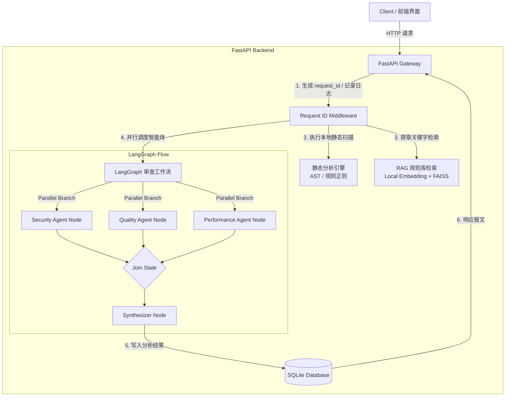

# Enterprise Code-Review-Agent Redesign Specification

## 1. 概述 (Overview)
本项目旨在将原有的单体 Gradio `Code-Review-Agent` 原型重构为一个生产就绪、易于扩展的**企业级多智能体代码审查平台**。通过引入 **FastAPI、LangGraph、SQLite 结构化存储、Loguru 结构化日志追踪** 以及 **Docker 容器化**，解决原有系统在并发控制、多语言扩展、日志链路追踪和离线化部署等方面的不足，并为面试场景提供深度的工程化能力展示。

---

## 2. 系统架构 (System Architecture)

### 2.1 拓扑结构 (System Topology)


### 2.2 核心模块设计

#### 2.2.1 API 契约与异步演进思路 (FastAPI)
为了适配高并发与长耗时任务，API 预留了异步任务的轮询接口契约：
*   **提交审查**：`POST /api/v1/review`
    *   *Payload*: `{"code": "...", "filename": "app.py"}`
    *   *Response (MVP)*: 同步返回报告与得分（为便于演示）。
    *   *未来生产演进*: 返回 `{"task_id": "...", "status": "pending"}`，后台由 Celery / Redis 队列处理。
*   **状态查询**：`GET /api/v1/review/{task_id}/status`
    *   *Response*: `{"task_id": "...", "status": "running/completed/failed", "result": null}`
*   **历史查询**：`GET /api/v1/history`
    *   *Response*: 返回历史审查报告的列表（含时间戳、主评分、安全级别）。
*   **单次报告**：`GET /api/v1/history/{review_id}`
    *   *Response*: 返回单次审查的完整 Markdown 及各 Agent 运行细节。

#### 2.2.2 存储设计 (SQLite Database)
使用 SQLite 作为轻量级本地持久化方案。为了体现面试中的规范化与可观测性设计，我们采用双表结构：
1.  **`reviews` 表**：记录最终生成的审查报告主信息。
2.  **`agent_runs` 表**：记录每个子 Agent 在执行过程中的耗时、消耗 Token 及执行状态，用于后期性能优化与监控。

##### `reviews` Schema
| 字段名 | 类型 | 说明 |
| :--- | :--- | :--- |
| `id` | VARCHAR(36) | 主键 (UUID) |
| `created_at` | DATETIME | 记录创建时间 |
| `filename` | VARCHAR(255) | 待审查文件名 |
| `code_snippet` | TEXT | 原始代码前缀或全文 |
| `score` | INTEGER | 最终综合评分 (0-100) |
| `risk_level` | VARCHAR(10) | 安全风险等级 (high/medium/low) |
| `report` | TEXT | 最终的 Markdown 审查报告全文 |
| `status` | VARCHAR(20) | 任务状态 (completed/failed) |
| `total_latency_ms`| INTEGER | 总审查耗时 (毫秒) |

##### `agent_runs` Schema
| 字段名 | 类型 | 说明 |
| :--- | :--- | :--- |
| `id` | VARCHAR(36) | 主键 (UUID) |
| `review_id` | VARCHAR(36) | 外键关联 `reviews.id` |
| `agent_name` | VARCHAR(50) | 智能体名称 (security/quality/performance) |
| `status` | VARCHAR(20) | 智能体执行状态 (completed/failed) |
| `latency_ms` | INTEGER | 节点执行耗时 (毫秒) |
| `token_input` | INTEGER | 输入 Token 消耗 |
| `token_output` | INTEGER | 输出 Token 消耗 |
| `result` | TEXT | 该 Agent 产出的子报告文本 |
| `error_message`| TEXT | 节点报错时的异常信息 |

#### 2.2.3 日志与请求链路追踪 (Structured Logging)
*   **Request ID 拦截器**：FastAPI 中间件在请求入口捕获或生成唯一的 `X-Request-ID`，并使用 Python 的 `contextvars` 维持线程隔离的上下文环境。
*   **结构化日志格式**：使用 `loguru` 将日志输出为标准 JSON 格式（或易读的标准格式），保证每次审查请求所调用的静态分析工具、RAG 检索、各 Agent 节点及 DB 写入日志均带有同一个 `request_id`。
```json
{
  "timestamp": "2026-06-27T17:15:30.123456Z",
  "level": "INFO",
  "request_id": "req-9b1b7a32-15d9-482a-a92c-55c328e932ba",
  "event": "agent_node_finished",
  "agent": "security_reviewer",
  "latency_ms": 1245,
  "tokens": 420,
  "status": "success"
}
```

#### 2.2.4 RAG 检索边界界定 (RAG Boundaries)
*   **检索定位**：RAG 的向量库中**仅存储开发规范文档、业界安全漏洞防御标准（如 OWASP Top 10）以及团队内部的最佳实践规约**，而非存储用户提交的代码。
*   **检索流程**：
    1.  当静态工具检测到具体 Issue（例如 AST 检查出“魔法数字”、正则检查出“硬编码密码”）时，提取对应的“问题关键字”。
    2.  利用本地的 `SentenceTransformer` 对关键字编码，在 FAISS 库中检索最匹配的**“规范修复建议条目”**。
    3.  将规范条目作为 Context 喂给 LLM 节点，以保证 Agent 给出的修复方案是符合规范的标准方案。

#### 2.2.5 容器化与网络隔离设计 (Docker)
*   **离线推理就绪**：`Dockerfile` 采用构建阶段联网下载模型并内置的策略，确保生产运行时纯离线加载 Embedding。
    ```dockerfile
    # 在镜像构建阶段联网拉取 SentenceTransformer 模型缓存
    RUN python -c "from sentence_transformers import SentenceTransformer; SentenceTransformer('sentence-transformers/all-MiniLM-L6-v2')"
    
    # 运行时开启离线环境变量，禁止从 Hugging Face 联网拉取
    ENV HF_HUB_OFFLINE=1
    ENV TRANSFORMERS_OFFLINE=1
    ```
*   **网络划分**：
    *   **本地组件（模型、RAG、FAISS 检索、SQLite）**：运行在容器本地，完全离线且安全。
    *   **LLM 节点**：根据配置，仅在运行时通过安全的 HTTPS 请求（在 `.env` 中提供 Key）调用外部 LLM API（如 DeepSeek/OpenAI），系统并非全离线，而是“本地计算 + 外部 API”混合模式。

---

## 3. 详细设计 (Detailed Module Specifications)

### 3.1 LangGraph 状态与图定义
```python
from typing import TypedDict, Dict, Any

class ReviewState(TypedDict):
    code: str
    filename: str
    static_results: Dict[str, Any]
    rag_context: str
    security_report: str
    quality_report: str
    performance_report: str
    final_report: str
    # 统计数据
    metrics: Dict[str, Any]  # 记录各节点执行时间、Token 消耗等
```

#### Graph 节点执行逻辑
1.  `run_static_tools_node(state)`:
    *   运行本地 Python 静态分析模块，将结果存入 `static_results`。
2.  `retrieve_rag_node(state)`:
    *   根据静态分析发现的漏洞/缺陷关键词，在向量库中检索规则与修复策略，写入 `rag_context`。
3.  `security_reviewer_node(state)`:
    *   调用 LLM 评估 `static_results["security"]` 并结合 `rag_context` 生成 `security_report`。
4.  `quality_reviewer_node(state)`:
    *   调用 LLM 评估 `static_results["quality"]` 并结合 `rag_context` 生成 `quality_report`。
5.  `performance_reviewer_node(state)`:
    *   调用 LLM 评估 `static_results["optimization"]` 并结合 `rag_context` 生成 `performance_report`。
6.  `synthesizer_node(state)`:
    *   读取三个子报告，汇总评分与全文，生成 `final_report`。

---

## 4. 面试宝典大白话 (Interview cheat sheet)

### Q1: 请求从哪里进来？
> **答**：请求首先通过网络到达暴露的 FastAPI Gateway 端口，进入 `POST /api/v1/review` 端点。在进入端点前，它会先通过我们的 **Request ID Middleware** 中间件，自动生成并在全局上下文注入该请求的唯一 UUID（`X-Request-ID`），同时开启日志链路跟踪。

### Q2: LangGraph 怎么执行的？
> **答**：FastAPI 端点接收代码后，实例化 LangGraph 图对象并调用 `graph.invoke(initial_state)`。整个图按拓扑顺序执行：首先是工具扫描与 RAG 检索的串行节点；随后进入**并行分叉**，并发触发安全、质量和性能三个 Agent 节点；最后汇聚到汇总节点（Synthesizer）进行报告组装。图的整个生命周期是状态共享且确定性的。

### Q3: 每个 Agent 负责什么？
> **答**：
> *   **Security Agent**：只看静态工具的安全警告，针对 SQL 注入、密钥泄露等高危问题结合 OWASP 规范进行深度二次校验与代码修复。
> *   **Quality Agent**：专注于函数复杂度、设计模式（SRP）、变量命名、魔鬼数字等代码规范和注释覆盖率审查。
> *   **Performance Agent**：专注于高时间复杂度循环、非 Pythonic 写法、内存占用等，给出优化前后对比。
> *   **Synthesizer Agent**：作为大 Leader，剔除子报告的重复内容，融合成统一语气的 Markdown 并综合计算主得分。

### Q4: 日志在哪里打的？
> **答**：日志在每个环节的入口、节点计算完、以及数据库写入和异常发生时触发。我们通过 `loguru` 将日志输出为结构化 JSON 并存储在持久化卷中。因为日志中全局注入了 `request_id`，所以可以通过该 ID 轻松捞出这一次请求从静态分析到大模型最终返回的完整操作链路。

### Q5: 历史记录怎么存的？
> **答**：系统将历史记录持久化存储在容器挂载路径下的 SQLite 文件数据库中。我们设计了**双表结构**：`reviews` 存储对外展现的报告结果；`agent_runs` 存储各 Agent 的执行状态、响应耗时、Token 消耗以及报错信息，以便将来做监控分析和 LLM 计费统计。

### Q6: Docker 怎么启动的？
> **答**：我们使用 `docker-compose up --build -d`。容器的 `Dockerfile` 使用多阶段或内置构建脚本，在**镜像构建阶段**即联网下载好 embedding 模型并烘烤（bake）在镜像内。在容器运行时直接开启 `HF_HUB_OFFLINE`，从而实现完全本地离线做向量检索，只有 LLM部分根据配置访问外部的 DeepSeek/OpenAI API。

### Q7: 线上失败了怎么排查？
> **答**：线上抛出异常时，FastAPI 中间件或特定节点捕获异常，并使用带 `request_id` 的 `logger.exception()` 记录错误堆栈。我们可以通过：
> 1. 查看 `logs/app.log`，通过报错接口的 `request_id` 一键过滤，还原整条调用链的节点日志；
> 2. 查询 SQLite 数据库中的 `agent_runs` 表，观察具体是哪个 Agent 阶段（如 `security`）因为什么原因（如 API 超时或 Token 溢出）返回了 `failed` 状态。
